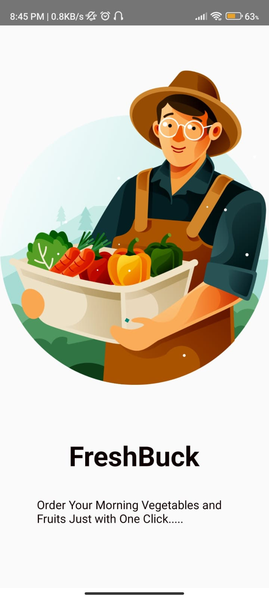
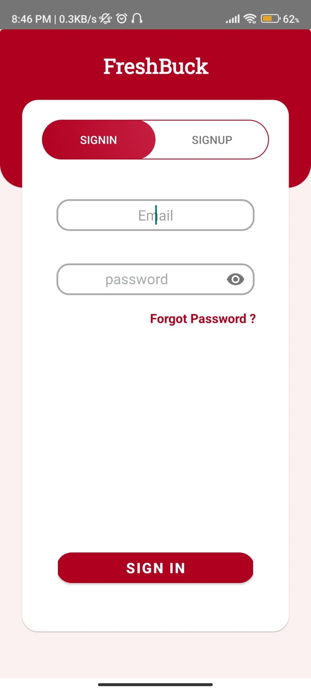
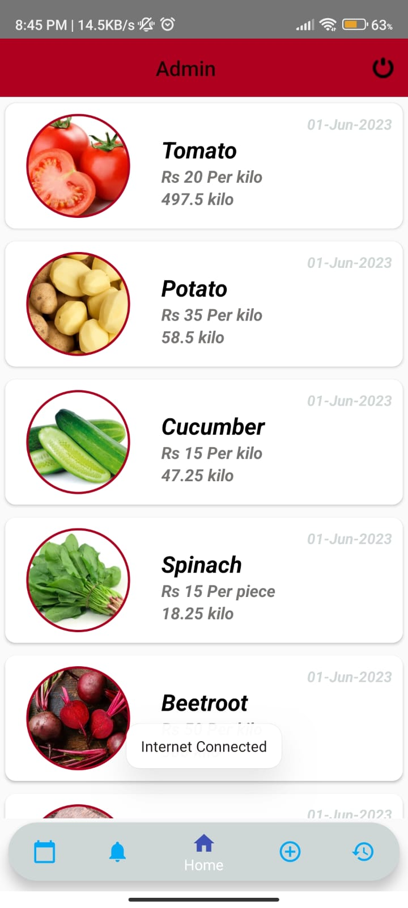
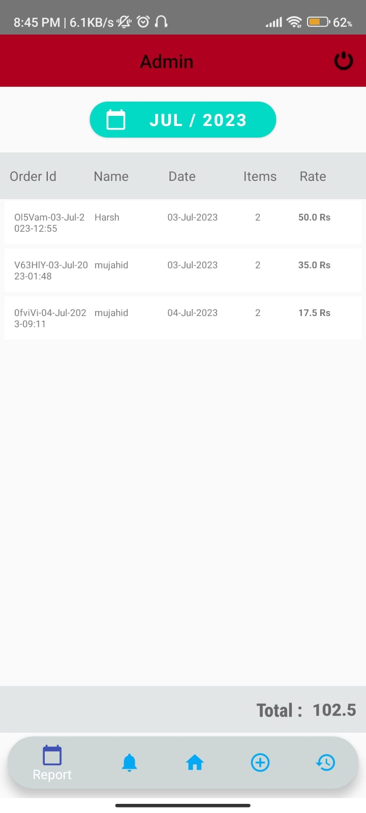
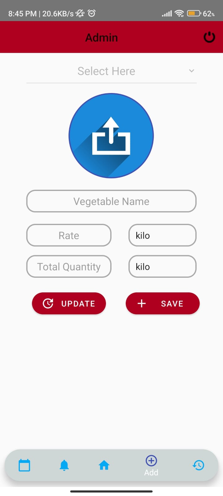
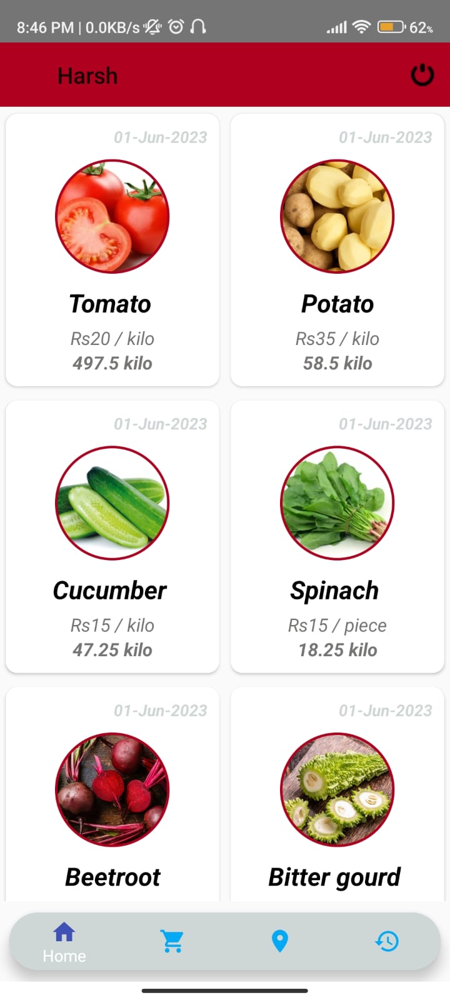
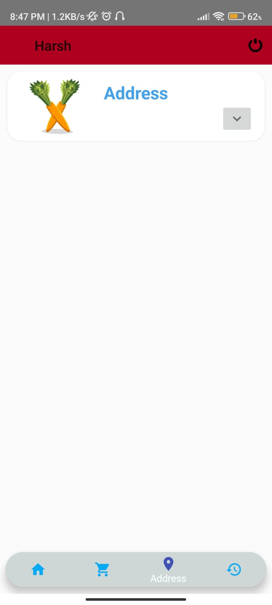
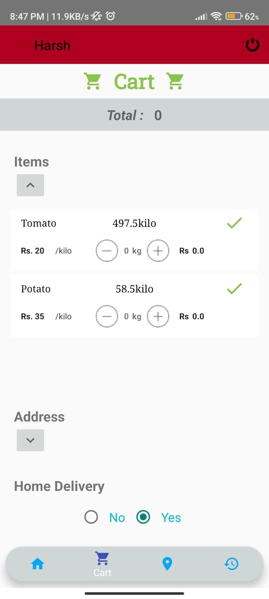
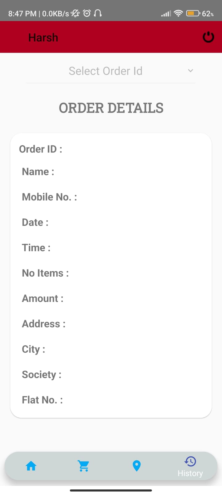

# FreshBuck

The FreshBuck application is a user-friendly mobile platform designed to address the 
challenges faced by busy individuals with early morning work commitments by providing 
a convenient and efficient way to order organic vegetables, fruits, dairy products, and dry 
fruits. The application aims to streamline the grocery shopping process and ensure timely 
doorstep delivery before breakfast, saving valuable time for the users. Implemented using 
Android Studio and written in Java, the FreshBuck application offers a range of features 
such as a user-friendly interface, product catalog with detailed descriptions and prices. The 
application also integrates with the Firebase backend platform for seamless data 
management and authentication.
  
  # Admin and User in One App

  # Admin 
  Admin can upload the Vegetables Quantity,Amount,Availability and can also update it. It also has many features for confirming orders and Generating Report of the 
  orders.uploaded images and data is stored in firebase.

  ## Admin Login and Password to be Stored in Firebase
  
  <table>
  <tr>
    <td></td>
    <td></td>
    <td></td>
    <td></td>
    <td></td>
  </tr>
 </table>

 # User
 User has to first store the Address and Order the Products , click on th check button in cart for ordering.History of the orders is also visible in UserActivity.  
<table>
  <tr>
    <td></td>
    <td></td>
    <td></td>
    <td></td>
    <td></td>
  </tr>
 </table>

# Admin Access 

```
 To gain admin access, you need to add your email ID to the admin child in Firebase.
 After adding it, try logging in with the same email ID, and you should see the Admin option.
```

##  Contributing

Contributions are always welcome!


# Clone the Repository

##  License

MIT License

Copyright (c) [2023]

Permission is hereby granted, free of charge, to any person obtaining a copy
of this software and associated documentation files (the "Software"), to deal
in the Software without restriction, including without limitation the rights
to use, copy, modify, merge, publish, distribute, sublicense, and/or sell
copies of the Software, and to permit persons to whom the Software is
furnished to do so, subject to the following conditions:

The above copyright notice and this permission notice shall be included in all
copies or substantial portions of the Software.

THE SOFTWARE IS PROVIDED "AS IS", WITHOUT WARRANTY OF ANY KIND, EXPRESS OR
IMPLIED, INCLUDING BUT NOT LIMITED TO THE WARRANTIES OF MERCHANTABILITY,
FITNESS FOR A PARTICULAR PURPOSE AND NONINFRINGEMENT. IN NO EVENT SHALL THE
AUTHORS OR COPYRIGHT HOLDERS BE LIABLE FOR ANY CLAIM, DAMAGES OR OTHER
LIABILITY, WHETHER IN AN ACTION OF CONTRACT, TORT OR OTHERWISE, ARISING FROM,
OUT OF OR IN CONNECTION WITH THE SOFTWARE OR THE USE OR OTHER DEALINGS IN THE
SOFTWARE.

<br/>

<p>If you liked the repository, show your ❤️ by starring .</p>


